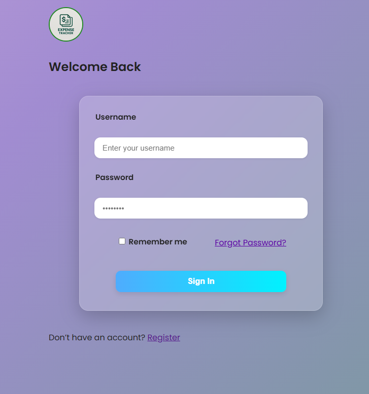
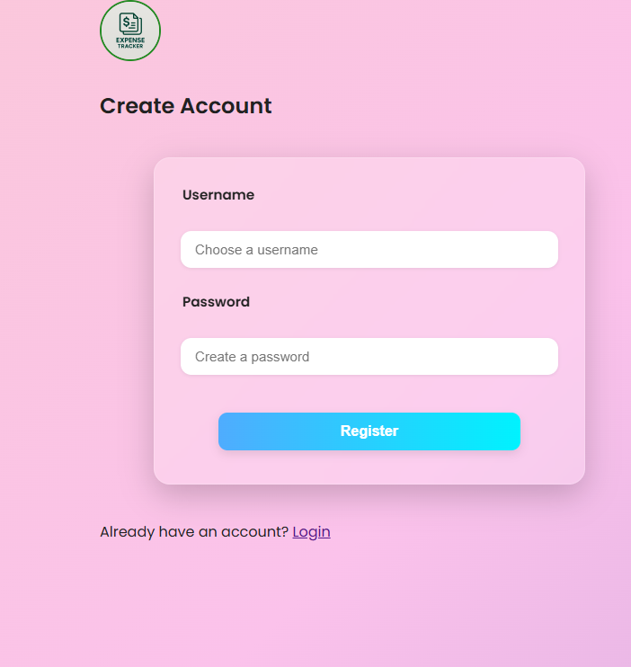
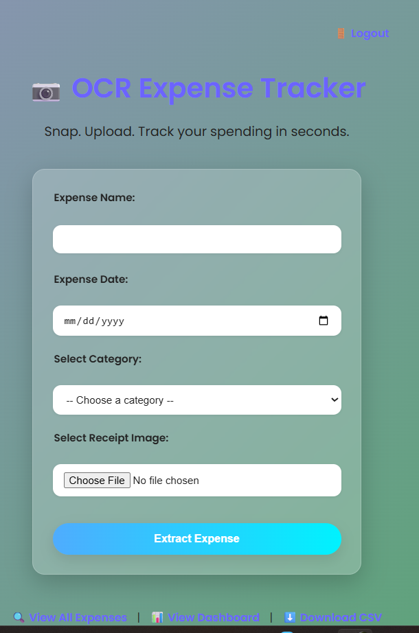
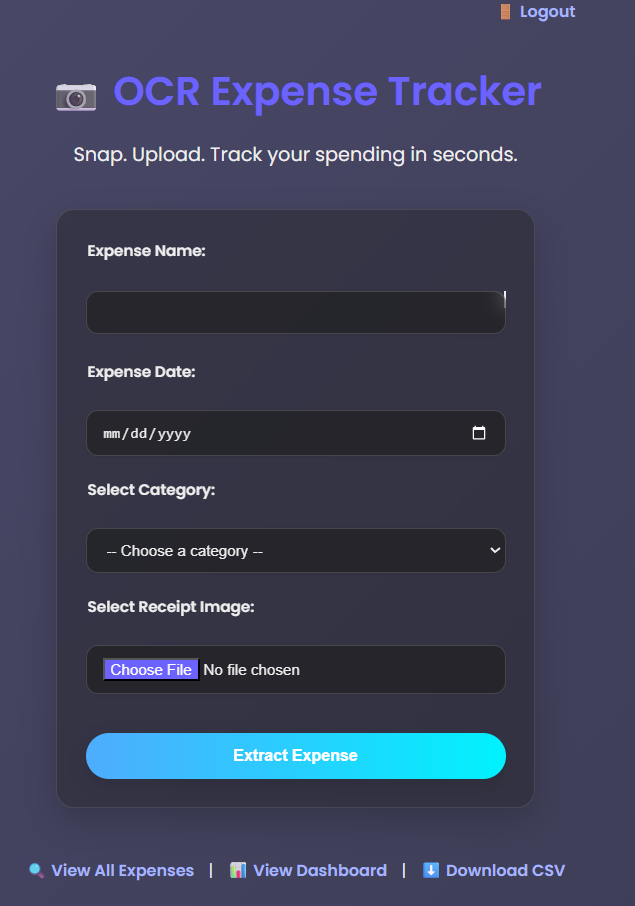
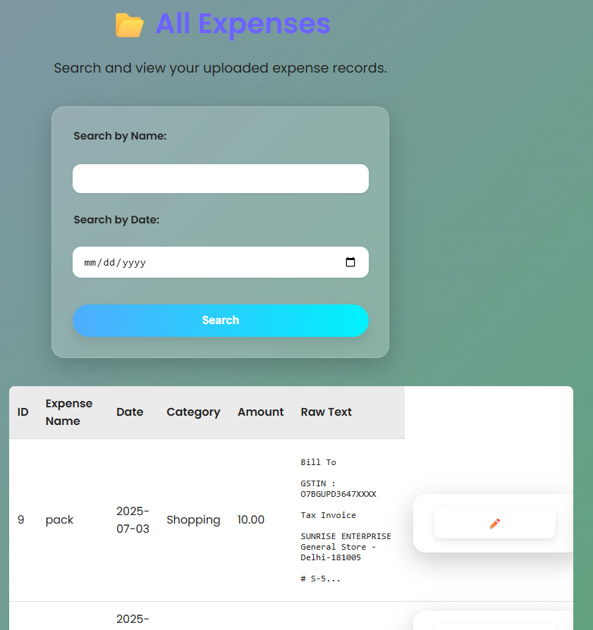
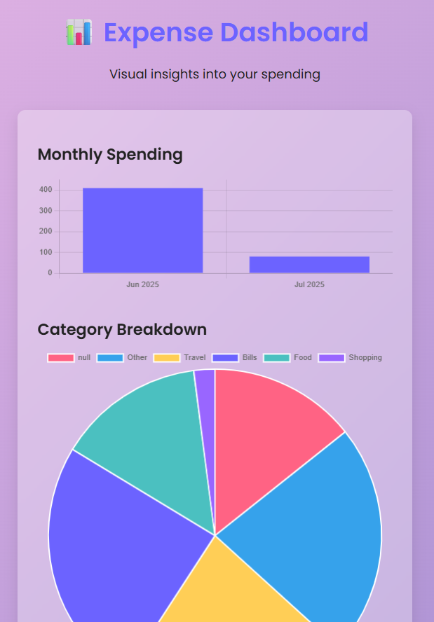

<h1 align="center">Hi 👋, I'm Ayushmita Bhattacharjee</h1>
<h3 align="center">🌐 Full Stack Web Developer | BCA Fresher | Passionate Learner</h3>

  

---

### 🙋‍♀️ About Me

- 🎓 BCA graduate from **JIS University** (CGPA: 9.03), Class of 2025  
- 💡 Passionate about **AI/ML**, **Full-Stack Web Development**  
- 🧾 Built a [Python OCR Expense Tracker App](https://github.com/Ayushmita24/ocr-expense-tracker) using Flask and Tesseract  
- 🛠️ Currently working on:
  - 🛍️ E-commerce web app
  - 📝 Note-taking app (MERN Stack)
- 📚 Learning: `DSA (Python + Java)`, `TensorFlow`, `AI/ML`, `Angular`  
- 📫 Reach me at: **ayushmitabhattacharjee609@gmail.com**  
- 📍 Based in **India**  
- 🌐 Portfolio: *Coming Soon*

---

### 🛠️ Tech Stack
**Frontend:**  
 
 
  
  

**Backend & Database:**  
  
  
  

**Tools & Platforms:**  
  
  
  

---

### 📊 GitHub Activity & Language Usage

<table>
  <tr>
    <td>
      
    </td>
    <td>
      
    </td>
  </tr>
</table>

---

### 🧠 My Real Tech Usage (Based on Projects)

| Language / Tool | Usage |
|------------------|--------|
|  | OCR app, DSA, backend |
|  | Python web backend |
|  | UI for projects |
|  | Styling |
|  | Interactions |

---

### 📜 Certifications

- ✅ [Introduction to Machine Learning – IIT Kharagpur (NPTEL)]
---

# 📄 OCR Expense Tracker

> A smart expense tracker that uses Optical Character Recognition (OCR) to extract and manage data from invoices and receipts.

---

### 🔍 Overview
This app allows users to upload receipts or invoices, automatically extract relevant details using OCR, and log them into a digital expense record. Ideal for individuals or small businesses tracking expenses with receipts.

---

### 💡 Features
- 📸 Upload or scan receipts (image or PDF)
- 🧠 OCR reads amount, date, vendor, and category
- 💾 Auto-saves extracted data to backend
- 📊 View all expenses + dashboard
- 📂 Export to CSV

---

### 🛠️ Tech Stack
- **Frontend:** HTML, CSS, React.js
- **Backend:** Node.js, Express
- **OCR Engine:** Tesseract.js
- **Database:** MongoDB (or any JSON-based storage)

---

### 📸 Screenshots

#### 🔐 Login & Register Pages

  

#### 🧾 Expense Entry + OCR Upload

#### 📁 View All Expenses

#### 📊 Dashboard Visualization

---
### 🚀 How to Run Locally

`
git clone https://github.com/YourUsername/ocr-expense-tracker`
`cd ocr-expense-tracker`
`npm install`
`npm start`

 💻 Built with ❤️ by <strong>Ayushmita</strong> · ✨ Open to opportunities · ☕ Fueled by code and chai 
 
